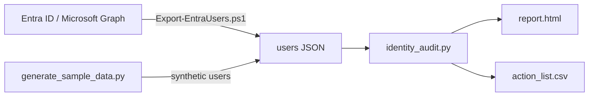

# Entra ID Identity Hygiene Audit

A quick audit of the accounts in Microsoft Entra ID (formerly Azure AD) that quietly weaken security: admins and users without MFA, people who stopped signing in months ago, and guest accounts nobody uses any more.

Built with Python (standard library only) and PowerShell. The repo includes a generator for **synthetic** data, so you can try it without access to a tenant.

## The problem

Identity is the front door. Most account takeovers start with an account that has no MFA, or with one that should have been removed long ago: a leaver whose account was never disabled, a contractor's guest access that outlived the project.

Nobody plans for these accounts to pile up; they just do. This tool gives IT and security teams one page that answers:

- What share of our users has registered MFA, and which departments lag behind?
- Is there any admin without MFA? (Fix that first.)
- Which enabled members have not signed in for months?
- Which guest accounts are no longer used?

## What it produces

- **`report.html`**: a single-file report with KPI tiles, MFA registration by department and the accounts that need action, with the reason for each. Works offline and supports light and dark mode.
- **`action_list.csv`**: the same list, ready for an access review or for tickets.

Only enabled accounts are checked; disabled accounts are counted in the report header.

| Issue | Rule |
|---|---|
| Admin without MFA | member with an admin role and no MFA method registered |
| No MFA registered | member without an MFA method registered |
| Inactive member | no sign-in for longer than the threshold (90 days by default) |
| Stale guest | guest with no sign-in for longer than the threshold |

Accounts that have never signed in are only flagged once they are older than the threshold, so new joiners are not reported on their first week. Guests are not checked for MFA because they usually authenticate in their home tenant.

## How it works



## Try it with sample data

Requires Python 3.10 or later. No extra packages needed.

```bash
git clone https://github.com/inigogonzalezgarcia/03-entra-id-hygiene-audit.git
cd 03-entra-id-hygiene-audit
python generate_sample_data.py
python identity_audit.py sample_data/entra_users.json
```

Open `output/report.html` in your browser.

Options:

```bash
python identity_audit.py users.json --inactive-days 60 --out-dir reports --title "Quarterly access review"
```

## Use it with your own tenant

1. Install the Microsoft Graph PowerShell SDK modules (once):
   ```powershell
   Install-Module Microsoft.Graph.Users, Microsoft.Graph.Reports -Scope CurrentUser
   ```
2. Export your users. You sign in with your own account; the script only asks for read-only permissions (`User.Read.All`, `AuditLog.Read.All`):
   ```powershell
   .\scripts\Export-EntraUsers.ps1 -OutputPath .\entra_users.json
   ```
3. Build the report:
   ```bash
   python identity_audit.py entra_users.json
   ```

Sign-in activity and the MFA registration report require Entra ID P1 or P2 and a role that can read them (for example Reports Reader or Global Reader). The export contains names and account details, so keep it and the report inside your organisation; both are excluded from Git by `.gitignore`.

## Tests

```bash
pip install pytest
python -m pytest
```

## Next steps

- Flag admins whose MFA methods are weak (SMS or voice only).
- Compare two exports to show progress between access reviews.
- Optional list of guests grouped by inviting domain, to review with each partner.

## Background

Inspired by years of running IT operations in regulated, multi-site environments, where access reviews, joiners and leavers, and MFA rollouts are part of the day-to-day. Built from scratch with synthetic data; no employer code or data is used.

## Customisation and contact

Need a version adapted to your environment (your own rules and thresholds, extra checks such as licences or Conditional Access, a scheduled monthly report)? Get in touch:

- Email: [inigogonzalezgarcia@yahoo.es](mailto:inigogonzalezgarcia@yahoo.es)
- LinkedIn: [linkedin.com/in/igonzalez93](https://www.linkedin.com/in/igonzalez93)

## License

MIT
